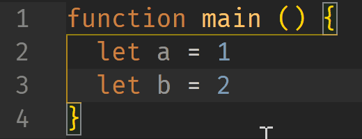
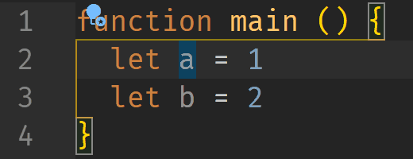

# Comment Line Down

If you have migrated from Webstorm to VSCode, you may find that the `toggle line comment` command differs between the two. The former will move to the next line after commenting a line while the latter won't. I'm used to the Webstorm style, but fail in finding similar settings or workarounds in VSCode, so this extension comes out. 

## Feature

Auto move cursor to the next line after toggle line comment.

## Configuration

* `commentLineDown.cursorPosition`:  

`home`  

`in situ` (default)  

`end`  

